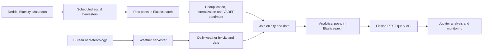

# Social Media Sentiment and Weather Analytics

**A report-based project case study.** This repository documents the architecture,
scale and limitations of a University of Melbourne Cluster and Cloud Computing
team project. Executable source and deployment manifests were not available in
the supplied local files or through anonymous access to the original GitLab
repository. No implementation has been reconstructed or presented as original code.

The project links sentiment in social media posts to daily weather observations
in **Melbourne, Sydney and Brisbane**. It combines scheduled collection,
historical backfill, text processing, Elasticsearch storage and a Fission REST
API deployed on Melbourne Research Cloud.

## System at a glance

| Layer | Reported tools and purpose |
| --- | --- |
| Infrastructure | Melbourne Research Cloud, OpenStack, Kubernetes |
| Functions | Fission harvesters, cleaning workflow and query API |
| Storage | Elasticsearch raw posts, analytical posts and daily weather |
| Analysis | VADER sentiment, city/date joins and Jupyter visualizations |
| Collection | API rate-limit handling, incremental retrieval and historical backfill |

## Reported data snapshot

The report records these counts on **13 May 2026**:

| Index | Records |
| --- | ---: |
| Raw social posts | 1,386,354 |
| Filtered, deduplicated analytical posts | 1,218,705 |
| Daily weather rows | 12,453 |

These are document counts in the reported deployment, not benchmark throughput
or the number of unique users. Weather rows are matched to posts by city and
date, so the join is not one weather row per post. The record counts were not
independently queried during portfolio preparation.

## Project contribution

The source report attributes **social media harvesting and historical backfill**
to Liang-Yu Chen. It credits teammates for cloud deployment/API integration,
weather processing, monitoring, and analysis. The complete contribution table
is preserved in [AUTHORS.md](AUTHORS.md).

## Documentation

- [Architecture and data flow](docs/architecture.md)
- [Data interpretation and limitations](docs/data-and-limitations.md)
- [Source availability and reproduction status](docs/reproduction.md)
- [Provenance and attribution](docs/provenance.md)

Original project: [University GitLab repository](https://gitlab.unimelb.edu.au/YUMZHU/comp90024_team_2).
Access may require university authentication. This case study does not include
API credentials, private endpoint addresses, raw social posts, student IDs,
or the full report.
