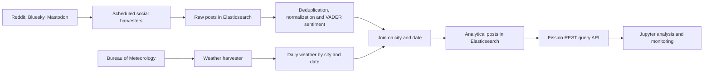

# Kubernetes Pipeline for Linking Social Media Sentiment with Daily Weather Data

This project links sentiment in social media posts to daily weather observations
in **Melbourne, Sydney and Brisbane**. It combines API harvesting across three
social media platforms, rate-limit handling, historical backfill, sentiment
scoring, Elasticsearch storage and Fission REST APIs on Melbourne Research Cloud.
Posts are matched to daily weather records by city and date. The project was developed for Cluster and Cloud
Computing at the University of Melbourne.

**This repository is an architecture case study based on the project report.**
Implementation and deployment files are not included. The
[original GitLab project](https://gitlab.unimelb.edu.au/YUMZHU/comp90024_team_2)
requires authentication.

## System at a glance

| Layer | Reported tools and purpose |
| --- | --- |
| Infrastructure | Melbourne Research Cloud, OpenStack, Kubernetes |
| Functions | Fission harvesters, cleaning workflow and query API |
| Storage | Elasticsearch raw posts, analytical posts and daily weather |
| Analysis | VADER sentiment, city/date joins and Jupyter visualizations |
| Collection | Reddit, Bluesky and Mastodon APIs, incremental retrieval and historical backfill |

## Reported data snapshot

The report records these counts on **13 May 2026**:

| Index | Records |
| --- | ---: |
| Raw social posts | 1,386,354 |
| Filtered, deduplicated analytical posts | 1,218,705 |
| Daily weather rows | 12,453 |

These are document counts in the reported deployment, not benchmark throughput
or the number of unique users. Posts are matched to weather by city and date,
with multiple posts sharing a daily observation. The counts come from the
project report rather than a new query of the original deployment.

## Project contribution

Liang-Yu Chen developed **social media harvesting and historical backfill**.
The report also credits teammates for cloud deployment and API integration,
weather processing, monitoring, and analysis. See the
[team contribution table](AUTHORS.md).

## Documentation

- [Architecture and data flow](docs/architecture.md)
- [Data interpretation and limitations](docs/data-and-limitations.md)
- [Source availability and reproduction status](docs/reproduction.md)
- [Provenance and attribution](docs/provenance.md)

The case study covers the system design, processing stages, and reported data
scale. It does not include a runnable service or redistribute raw social posts.
